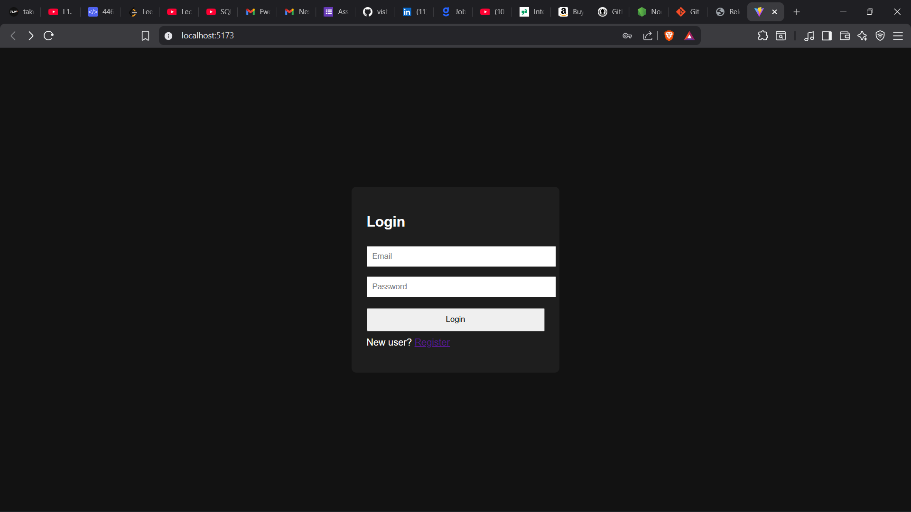
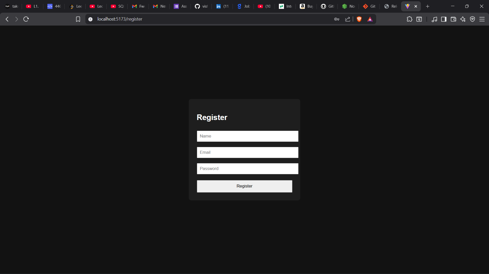
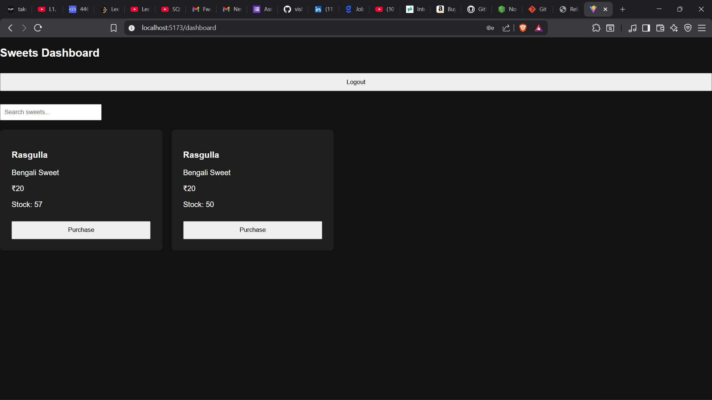

🍬 Sweet Shop Management System

A full-stack Sweet Shop Management System built using Node.js, Express, MySQL, React, and JWT authentication.
The application allows users to register, log in, view available sweets, purchase sweets, and enables admin users to manage sweet inventory.

This project follows clean coding practices and Test-Driven Development (TDD) principles for backend logic.

📌 Project Objective

The objective of this project is to design and implement a complete RESTful full-stack application that demonstrates:

Secure authentication and authorization

Inventory management with real database integration

Test-driven backend development

Frontend-backend integration using modern tools

Responsible usage of AI tools in software development

🚀 Features
🔐 Authentication

User registration

User login

JWT-based authentication

Role-based authorization (User / Admin)

🍭 Sweet Management

View all available sweets

Search sweets by:

Name

Category

Price range

Purchase sweets (quantity decreases)

Purchase button disabled when stock is zero

🛠 Admin Features

Add new sweets

Restock sweets

Delete sweets (Admin only)

🧪 Testing

Backend APIs tested using Jest and Supertest

Separate test database used to avoid polluting development data

Tests cover authentication and sweet operations

🧑‍💻 Tech Stack
Backend

Node.js

Express.js

MySQL

Sequelize ORM

JWT (JSON Web Token)

bcrypt

Jest & Supertest

Frontend

React (Vite)

Axios

React Router DOM

Basic CSS

Tools

Git & GitHub

VS Code

Thunder Client / Postman

MySQL Workbench

📂 Project Structure
sweet-shop/
│
├── backend/
│   ├── src/
│   │   ├── controllers/
│   │   ├── middleware/
│   │   ├── models/
│   │   ├── routes/
│   │   ├── tests/
│   │   └── app.js
│   ├── server.js
│   ├── jest.config.js
│   └── .env
│
└── frontend/
    └── src/
        ├── components/
        ├── pages/
        ├── services/
        └── App.jsx

⚙️ Setup Instructions
1️⃣ Clone the Repository
git clone https://github.com/vishall03/sweet-shop-management-system.git
cd sweet-shop

2️⃣ Backend Setup
cd backend
npm install

Create a .env file in the backend folder:
PORT=5000
DB_NAME=sweet_shop_db
DB_USER=root
DB_PASS=your_mysql_password
DB_HOST=localhost
JWT_SECRET=supersecretkey

Create database in MySQL:
CREATE DATABASE sweet_shop_db;

Run backend server:
node server.js

Backend runs on: http://localhost:5000

3️⃣ Frontend Setup
cd frontend
npm install
npm run dev

Frontend runs on: http://localhost:5173

🧪 Running Tests

Backend tests are written using Jest and Supertest.
cd backend
npm test
Tests use a separate test database

Includes tests for authentication and sweet APIs

📸 Screenshots
## 🔐 Login Page

## 📝 Register Page

## 📊 Dashboard

## 🛒 Purchase Sweet

## 🔍 Search Feature

I used ChatGPT as an AI assistant during this project to support my development process.
AI was used for:

Brainstorming API structures and project architecture

Generating initial boilerplate code for controllers and routes

Writing and refining Jest test cases

Debugging JWT authentication and middleware logic

Improving code readability and structure

All AI-generated suggestions were reviewed, understood, and manually integrated.
Final implementation decisions, debugging, and customization were done by me to ensure correctness and learning.

🧠 Learning Outcomes

Designed and implemented secure REST APIs

Implemented JWT-based authentication and role-based authorization

Practiced Test-Driven Development (TDD)

Built a full-stack application with React and Node.js

Integrated Sequelize ORM with MySQL

Used Git and GitHub professionally with meaningful commits

Learned responsible and transparent use of AI tools

